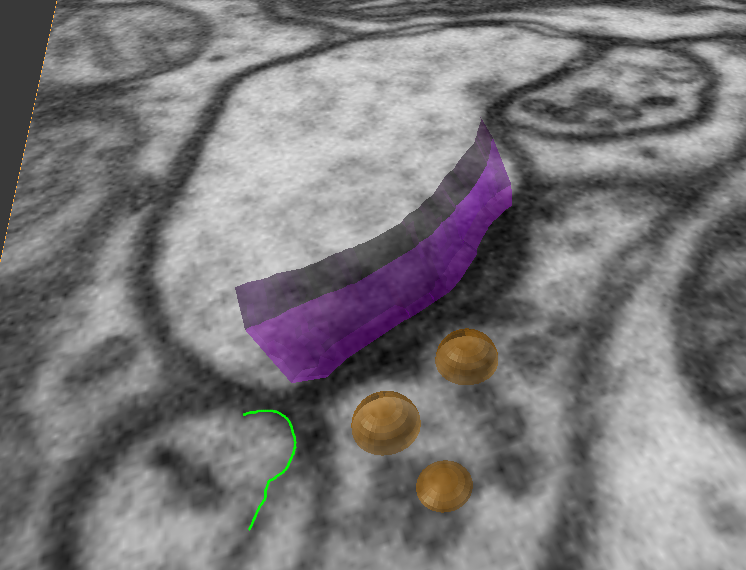

<a onmousedown="(function(i,s,o,g,r,a,m){i['GoogleAnalyticsObject']=r;i[r]=i[r]||function(){
  (i[r].q=i[r].q||[]).push(arguments)},i[r].l=1*new Date();a=s.createElement(o),
  m=s.getElementsByTagName(o)[0];a.async=1;a.src=g;m.parentNode.insertBefore(a,m)
  })(window,document,'script','https://www.google-analytics.com/analytics.js','ga');
  ga('create', 'UA-99596205-1', 'auto');
  ga('send', 'pageview');
  ga('send', 'event', 'Link', 'Link to Blender Wiki', '3D Drawing');" href="https://github.com/NeuroMorph-EPFL/NeuroMorph/wiki/3D-Drawing">Full Documentation</a>  

#### NeuroMorph 3D Drawing   
<a onmousedown="(function(i,s,o,g,r,a,m){i['GoogleAnalyticsObject']=r;i[r]=i[r]||function(){
  (i[r].q=i[r].q||[]).push(arguments)},i[r].l=1*new Date();a=s.createElement(o),
  m=s.getElementsByTagName(o)[0];a.async=1;a.src=g;m.parentNode.insertBefore(a,m)
  })(window,document,'script','https://www.google-analytics.com/analytics.js','ga');
  ga('create', 'UA-99596205-1', 'auto');
  ga('send', 'pageview');
  ga('send', 'event', 'Download', 'Download code', '3D Drawing');" href="http://raw.githubusercontent.com/NeuroMorph-EPFL/NeuroMorph/master/NeuroMorph_3D_Drawing/NeuroMorph_3D_Drawing.py">Download</a>

Scroll through image stacks in 3D. Place spherical markers (eg vesicles) on images, and draw lines that can be constructed into both open surfaces (eg synapses) and closed surfaces (eg mitochondria) in 3D. Open surfaces with holes are handled. Closed surfaces that branch are not handled.

#### NeuroMorph Retrieve Object from Image   
<a onmousedown="ga('send', 'event', 'Download', 'Download code', 'Retrieve Object from Image');" href="http://raw.githubusercontent.com/NeuroMorph-EPFL/NeuroMorph/master/NeuroMorph_3D_Drawing/NeuroMorph_Retrieve_Object_from_Image.py">Download</a> 

Objects existing at any image point can be retrieved (made visible), allowing for easy navigation of object connectivity. Requires the 3D Drawing tool to be loaded.

