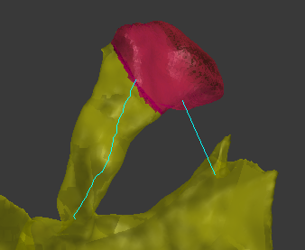

[Full Documentation](https://github.com/NeuroMorph-EPFL/NeuroMorph/wiki/Measurement-Tools)  

#### NeuroMorph Measurement Tools  
[Download](https://raw.githubusercontent.com/NeuroMorph-EPFL/NeuroMorph/master/NeuroMorph_Measurement_Tools/NeuroMorph_Measurement_Tools.py)  

Measure surface areas, volumes, and lengths of user-defined regions of meshes. Measurements can be exported for analysis.

Updated from the original Neuromorph Toolkit, now with three different length measurement options all based on currently active vertices.  This module measures surface areas, volumes, and lengths of regions of meshes specified by a user-defined selection of vertices. New objects are created as children of the original mesh object, and the measurements are stored in appropriate property variables of these children objects in the Geometry Properties panel of the Object context (bottom right of the Blender interface, see documentation for details).  Measurements can be exported into a .txt file that can be read by Excel.

