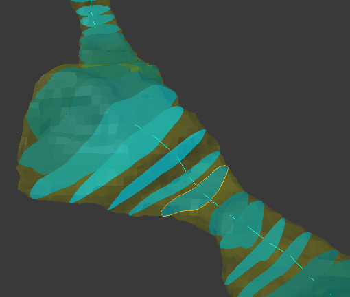

#### NeuroMorph Centerline Processing   ([download](http://raw.githubusercontent.com/ajorstad/NeuroMorph/master/NeuroMorph_CenterLines_CrossSections/NeuroMorph_Centerline_Processing.py))

Processes center lines generated by the [Vascular Modeling Toolkit (VMTK)](http://www.vmtk.org/tutorials/Centerlines.html), perform calculations in Blender using these center lines. Includes tools to clean meshes, export meshes to VMTK, and import center lines generated by VMTK. Also includes tools to generate cross-sectional surfaces, calculate surface areas of the mesh along the center line, and project vesicle objects onto the center line. Data can be exported for analysis.

