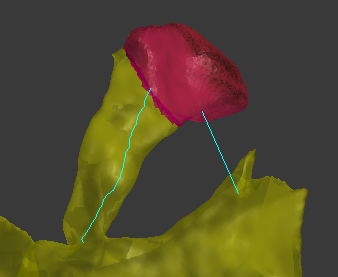

User's guides coming soon!

#### NeuroMorph Centerline Processing   ([download](http://raw.githubusercontent.com/ajorstad/NeuroMorph/master/NeuroMorph_New_Tools/NeuroMorph_Centerline_Processing.py))
This module processes center lines generated by [VMTK](http://www.vmtk.org/tutorials/Centerlines.html), and performs calculations in Blender using these center lines.  It includes a tool to clean meshes, to export meshes for VMTK, and to import center lines generated by VMTK.  It also includes a tool to generate cross-sectional surfaces and surface areas of the mesh along the center line, and a tool to project vesicle objects onto the center line.  This data can be exported for analysis.
    

#### NeuroMorph Measurement Tools  ([download](https://raw.githubusercontent.com/ajorstad/NeuroMorph/master/NeuroMorph_New_Tools/NeuroMorph_Measurement_Tools.py))
Updated from the original Neuromorph Toolkit, now with three different length measurement options all based on currently active vertices.  This module measures surface areas, volumes, and lengths of regions of meshes specified by a user-defined selection of vertices. New objects are created as children of the original mesh object, and the measurements are stored in appropriate property variables of these children objects in the Geometry Properties panel of the Object context (bottom right of the Blender interface, see documentation for details).  Measurements can be exported into a .txt file that can be read by Excel.

#### NeuroMorph Naming  ([download](https://raw.githubusercontent.com/ajorstad/NeuroMorph/master/NeuroMorph_New_Tools/NeuroMorph_Naming.py))
Previously part of the NeuroMorph Measurement Tools, allows objects to be named according to a naming convention developed for neural structures.

#### NeuroMorph Parent-Child Tools   ([download](http://raw.githubusercontent.com/ajorstad/NeuroMorph/master/NeuroMorph_New_Tools/NeuroMorph_Parent_Child_Tools.py))
This module allows the user to easily to show/hide all children of an object, delete all children of an object, and assign the parent of all selected objects.

#### NeuroMorph Stack Notation   ([download](http://raw.githubusercontent.com/ajorstad/NeuroMorph/master/NeuroMorph_New_Tools/NeuroMorph_Stack_Notation.py))
This module allows the user to scroll through images stacks in all 3 dimensions, place spherical markers (vesicles) on images in 3D, and draw lines that can be constructed into both open surfaces (synapses) and closed surfaces (mitochondria) in 3D.  Open surfaces with holes are handled.  Closed surfaces that branch cannot be handled.

#### NeuroMorph Retrieve Object from Image   ([download](http://raw.githubusercontent.com/ajorstad/NeuroMorph/master/NeuroMorph_New_Tools/NeuroMorph_Retrieve_Object_from_Image.py))
This module allows the user to select a point on an image and retrieve whatever 3D object in the scene contains that point, if any.  This function is a subset of the NeuroMorph Image Stack Interactions tool from the original NeuroMorph Toolkit; the rest of that tool's functionality is available in the NeuroMorph Stack Notation tool above, which must be loaded in order for this tool to work.

#### NeuroMorph Proximity Analysis   ([download](http://raw.githubusercontent.com/ajorstad/NeuroMorph/master/NeuroMorph_New_Tools/NeuroMorph_Proximity_Analysis.py))
This module calculates the surface regions of two surfaces that are within a given distance of each other.

