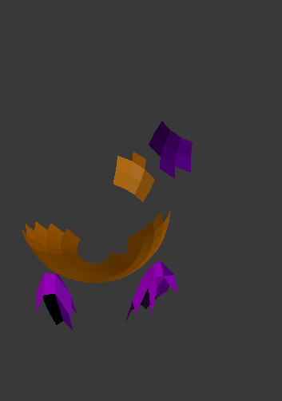
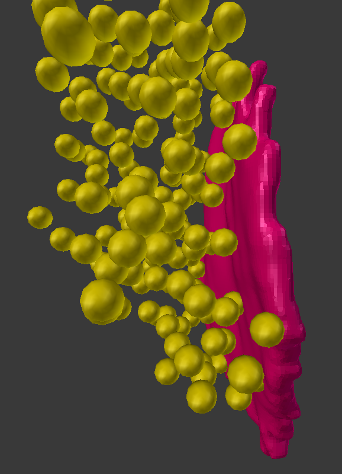

#### NeuroMorph Proximity Analysis   ([download](http://raw.githubusercontent.com/ajorstad/NeuroMorph/master/NeuroMorph_Proximity_Analysis/NeuroMorph_Proximity_Analysis.py))
This module calculates the surface regions of two surfaces that are within a given distance of each other.

#### NeuroMorph Synapse Vesicle Distances   ([download](http://dstats.net/download/http://github.com/ajorstad/NeuroMorph/raw/master/NeuroMorph_Proximity_Analysis/NeuroMorph_Vesicle_Distance.py))
The Synaptic Vesicle Distance Measure add-on computes and outputs the closest distance from the center of each vesicle to a synapse, given a 3D mesh representation of a synapse and balls marking the synaptic vesicles.  The tool expects each vesicle to be a distinct child object of the parent synapse object.

*Initially developed to provide analysis for the [paper](http://www.jneurosci.org/content/35/24/9024):*

Barnes SJ, Cheetham CE, Liu Y, Bennett SH, Albieri G, Jorstad AA, Knott GW, Finnerty GT.  (2015)  "Delayed and Temporally Imprecise Neurotransmission in Reorganizing Cortical Microcircuits." The Journal of Neuroscience, 35(24): 9024-9037.
